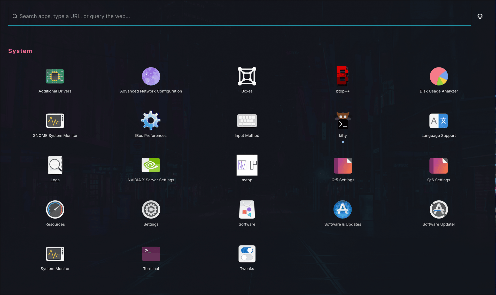
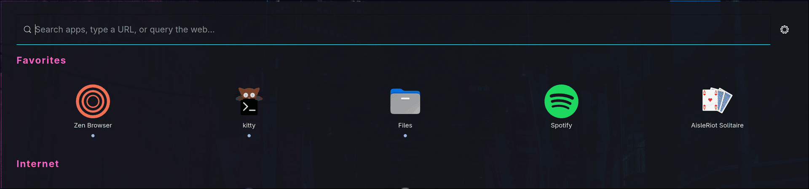
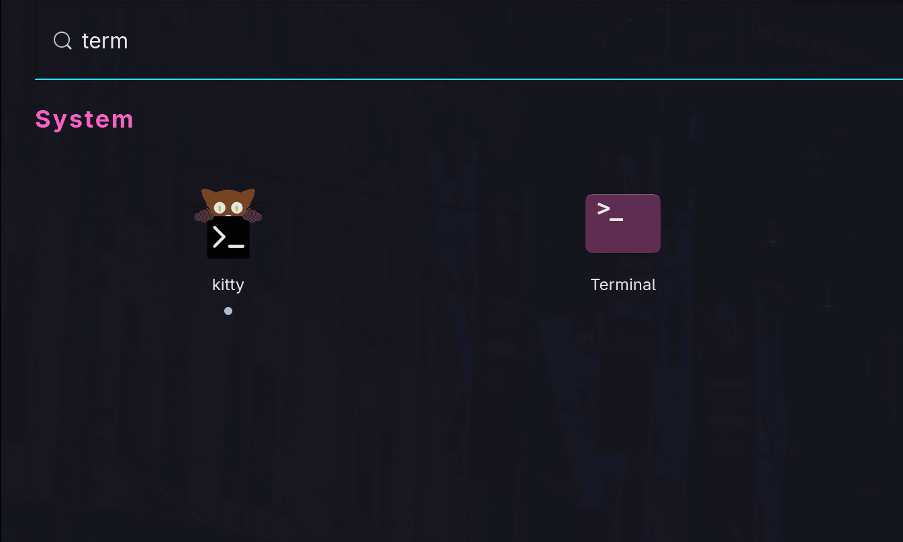
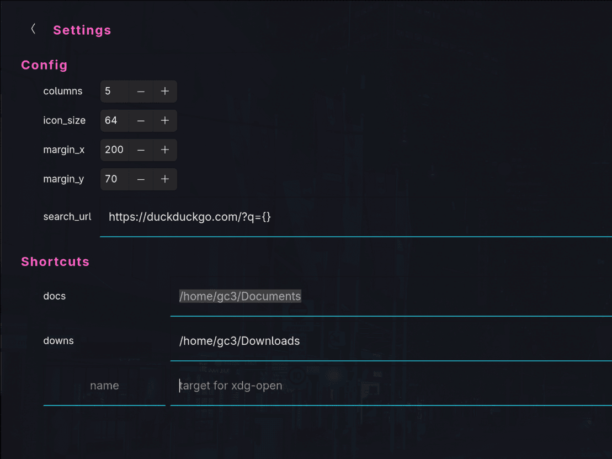

# waydrawer: a GTK4 app drawer for Wayland

An app grid + launcher bar for Wayland compositors — search your apps, pin
favorites, do quick math, open URLs, fall back to web search, and run your own
`xdg-open` shortcuts.

Inspired by the GNOME app drawer, which I couldn't find a standalone version of anywhere else.

Tested on Hyprland.




## Features

### Overview

- Search your installed apps with live filtering, grouped by category
- Pin/unpin a favorite with a right-click; favorites appear first
- Do basic arithmetic right in the search bar (result copied to the clipboard)
- Open a URL in your browser if the input looks like one
- Fall back to a web search when nothing else matches
- Save named **shortcuts** that get handed to `xdg-open`
- Edit config and shortcuts from a built-in **settings** view
- Optional **daemon mode** for near-instant open times
- CSS styling of the GTK components (with examples)

### Screenshots
Pin frequently-used apps to the top.



Start typing to filter instantly.



Configure shortcuts and behavior in-app.



## Dependencies

Runtime:

- Python 3.11+
- PyGObject, GTK4, gtk4-layer-shell
- wlr-layer-shell protocol in the wayland compositor (ie, not Gnome/Mutter)
- `wl-clipboard` (clipboard writes), `xdg-utils` (`xdg-open` for shortcuts)


`tomlkit` is vendored into the build, so you don't need to install it.

On Ubuntu:

```sh
sudo apt install python3-gi gir1.2-gtk-4.0 gir1.2-gtk4layershell-1.0 python3-setproctitle wl-clipboard xdg-utils
```

## Install

Builds the zipapp (vendoring `tomlkit`) and installs it to `~/.local/bin/waydrawer`:

```sh
make install
```

Override the location with `PREFIX` if you like: `make install PREFIX=/usr/local`.

## Keybindings

Hyprland (hyprlang):

```
bind = SUPER, Space, exec, waydrawer
```

Hyprland (Lua):

```lua
hl.bind("SUPER + Space", hl.dsp.exec_cmd("waydrawer"))
```

## Configuration

Files live in `~/.config/waydrawer/`.

User managed:

- `config.toml` — basic options (columns, icon size, etc)
- `shortcuts.toml` — your `name = "target"` shortcuts
- `style.css` — CSS for the GTK widgets

Waydrawer managed:

- `favorites.json` — pinned apps storage


Example files to copy from are in `config/`:

- `config/config.toml`
- `config/shortcuts.toml`
- `config/style.css`

## Running waydrawer

```
$ waydrawer -h
usage: waydrawer [-h] [-d | -q | -t | -s]

GTK4 app drawer for Wayland.

options:
  -h, --help      show this help message and exit
  -d, --daemon    run as a daemon: build the drawer once, show/hide on request
  -q, --quit      tell a running daemon to exit
  -t, --toggle    toggle the waydrawer ui
  -s, --settings  open waydrawer on the settings view
```

With a daemon running, `waydrawer` (or `--toggle`) shows the drawer instantly. `--settings` opens it straight to the settings view.

Without a daemon, each invocation is a slower, one-shot launch.
